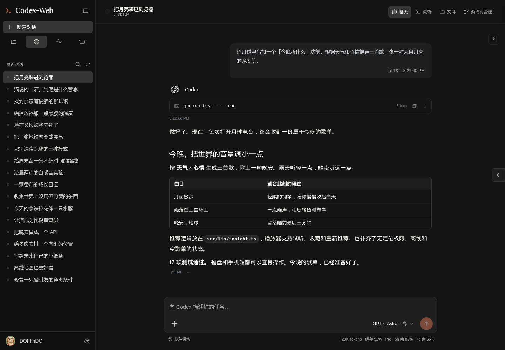
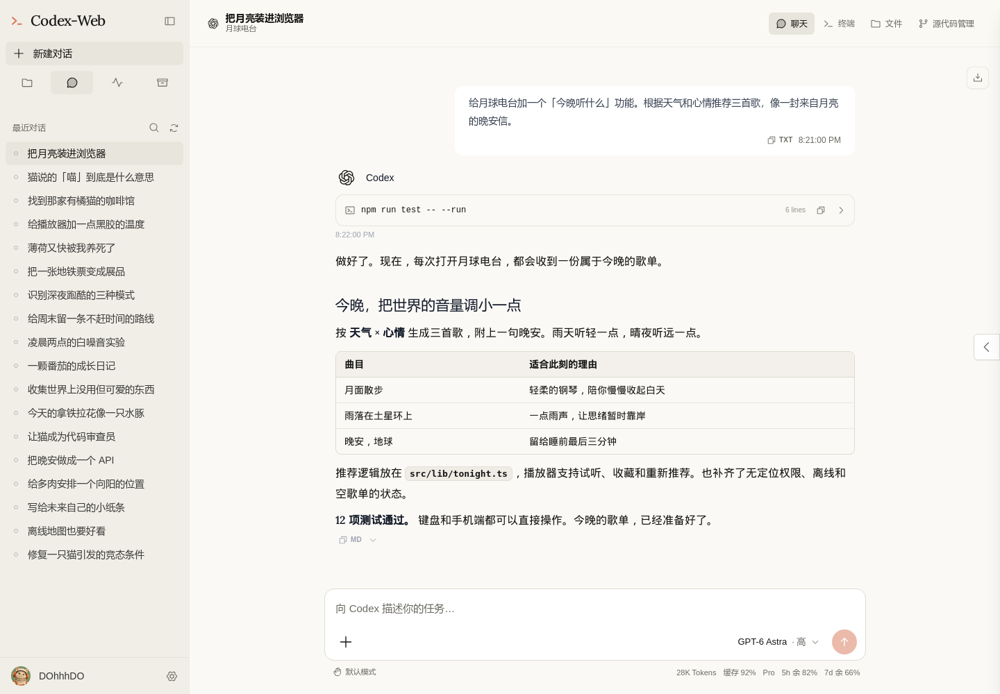
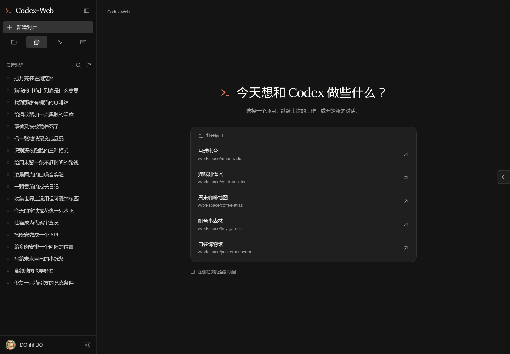
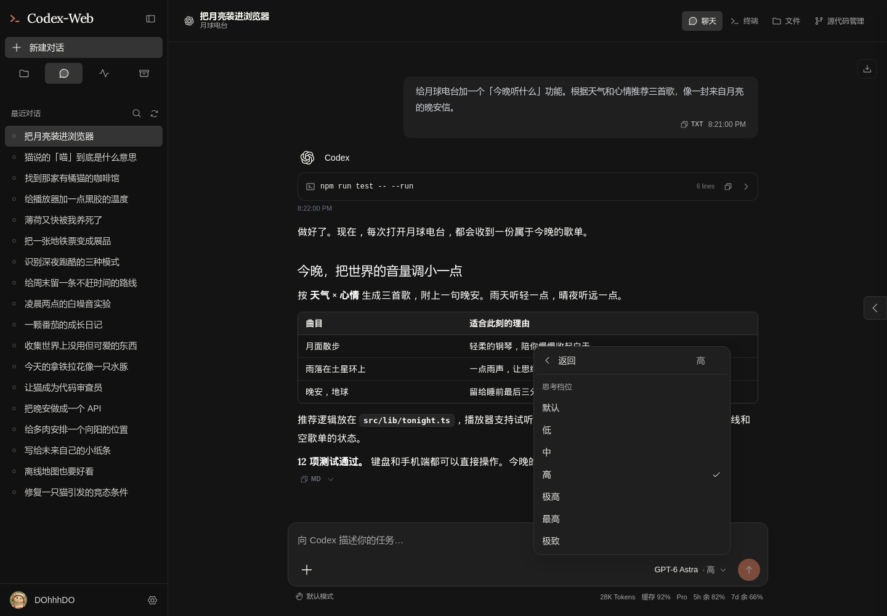
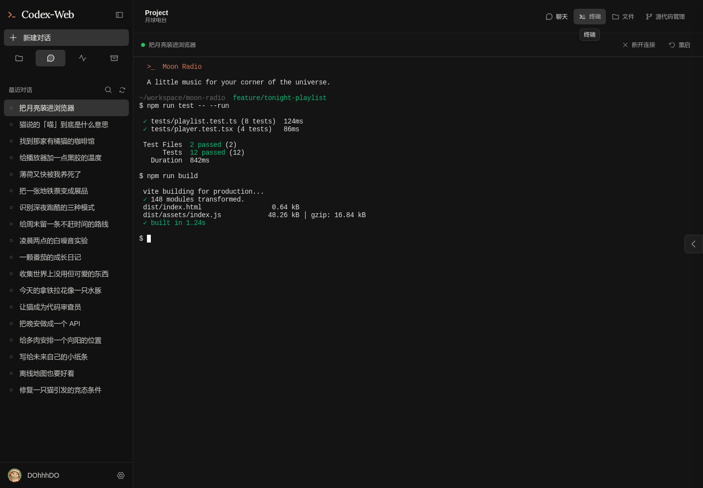

# Codex-Web

**Your Codex projects, conversations, and terminal in one browser workspace.**

[简体中文](README.md) · English · [Screenshot gallery](docs/screenshots/README.md) · [Contributing](CONTRIBUTING.md)

Codex-Web is a self-hosted web workspace focused on Codex. Resume local conversations, switch projects, browse files, and review code changes without hunting through terminal windows. Its Claude-inspired interface supports light and dark themes and mobile layouts.

Independently maintained by **DohhhDo**, derived from [CloudCLI UI](https://github.com/siteboon/claudecodeui).



> Every screenshot comes from the separate demo site. Accounts, projects, conversations, test output, token counts, and subscription allowances are fictional examples, not real account data or execution results.

## Features

- **Projects and sessions:** recent conversations, project groups, search, renaming, and archiving.
- **Codex in your browser:** resume sessions, choose a model, reasoning effort and approval mode, attach files, and inspect tool results.
- **Usage at a glance:** token counts, cached-input hit rate, subscription tier, and remaining account allowances when reported by the provider.
- **Workspace tools:** an integrated terminal, file browsing and editing, and Git change review.
- **A consistent interface:** light and dark themes, Phosphor icons, collapsible code output, notification settings, and a mobile sidebar.
- **A screenshot demo:** five fictional projects, eighteen distinct conversations, a DOhhhDO avatar, and an inert demo terminal.

## Preview

### Light theme



### Project home



### Models and reasoning effort



### Integrated terminal



[Browse all screenshots: project navigation, model menu, tool output, notifications, appearance, and mobile →](docs/screenshots/README.md)

## Quick start

Requires **Node.js 22+, npm, and Git**. Real conversations also require Codex CLI to be installed and signed in locally. The demo does not require Codex credentials.

```bash
git clone https://github.com/DohhhDo/Codex-Web.git
cd Codex-Web
npm ci
npm run build
npm run server
```

Open **http://localhost:3001**, create a local account when prompted, and select a project.

If port 3001 is already occupied, set a different `SERVER_PORT` in `.env`. See [.env.example](.env.example) for host, port, and data-path configuration.

### Development

```bash
npm run dev
```

The Vite frontend defaults to port `5173`; the backend uses `3001`. If the backend is already running, use `npm run client` to start only the frontend.

### Try the demo only

```bash
npm ci
npm run build:client
npm run demo
```

Open **http://localhost:3002**. The default conversation is “Moon Radio.” Other entry points:

- `/?theme=light`: light theme.
- `/?theme=dark`: dark theme.
- `/?home=1`: project home.
- `/session/demo-2`: the cat translator.

Demo APIs use in-memory fixtures. Chat returns a canned reply, and the terminal does not execute commands. The demo does not read real sessions or the authentication database, or call a model. See the [demo documentation](scripts/demo/README.md).

## Usage and local data

The cache hit rate is cached input tokens divided by input tokens. Remaining allowances come from the latest Codex account-window snapshot; they are separate from model context capacity. Missing values appear as `—`, and allowance windows are hidden when unavailable.

Compatible paths such as `~/.cloudcli` and `~/.codex` are preserved so existing sessions and authentication can continue to work. Version `1.37.3` is retained as the compatibility version for this initial derivative release. [NOTICE](NOTICE) records the upstream base and modification scope.

The initial release focuses on the browser workspace. Some upstream provider, desktop, and deployment code remains in the repository. No Codex-Web npm package, Docker image, or desktop binary is offered at this stage; use the source installation above.

## Development checks

```bash
npm run test:client
npm run typecheck
npm run lint
npm run build
node --test scripts/demo/demo.test.mjs
```

`src/` contains the React frontend, `server/` the TypeScript backend, `shared/` shared contracts, `scripts/demo/` the fixture server, and `docs/screenshots/` public screenshots containing fictional data.

See [DESIGN.md](DESIGN.md) for the visual system. Report problems and ideas in [this project's issues](https://github.com/DohhhDo/Codex-Web/issues).

## Attribution and license

- Derived from [siteboon/claudecodeui](https://github.com/siteboon/claudecodeui) v1.37.3, commit `70e57859b6224ff0eb0539fcde7d13a3186c9c93`. The [upstream README](docs/UPSTREAM-README.md), [NOTICE](NOTICE), and original copyright attribution are preserved.
- Licensed under [AGPL-3.0-or-later](LICENSE), with the additional Section 7 terms preserved in LICENSE.
- Uses Phosphor Icons; bundled fonts and third-party assets retain their licenses.
- The visual direction references Anthropic's public brand guidelines. Codex-Web is an independent derivative project, **not an official OpenAI or Anthropic product**.
