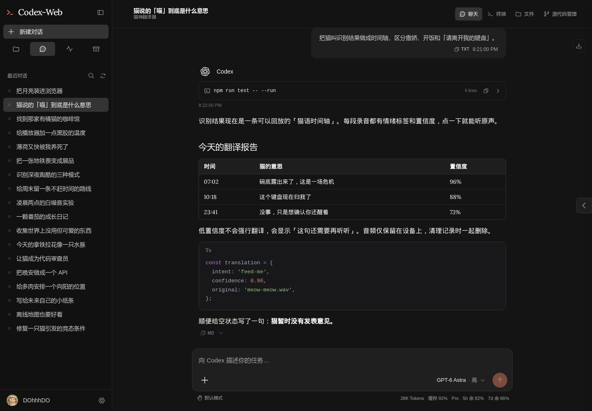
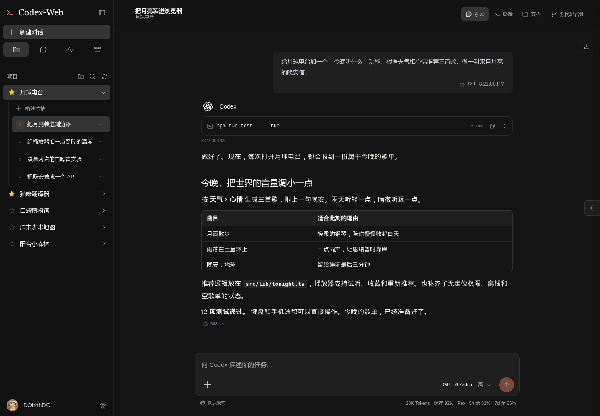
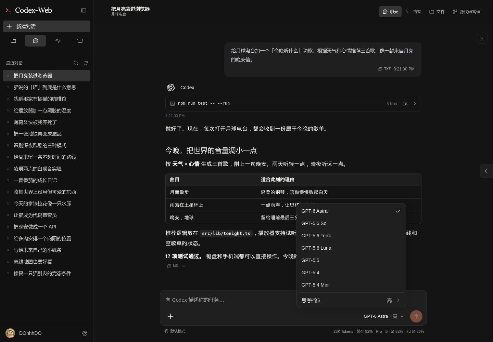
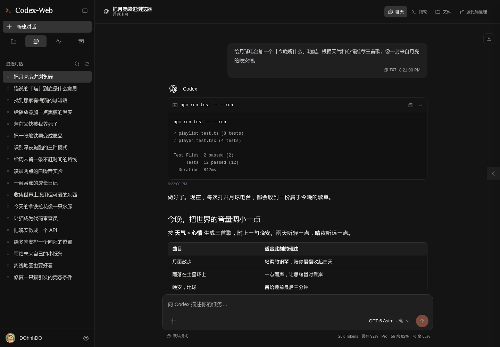
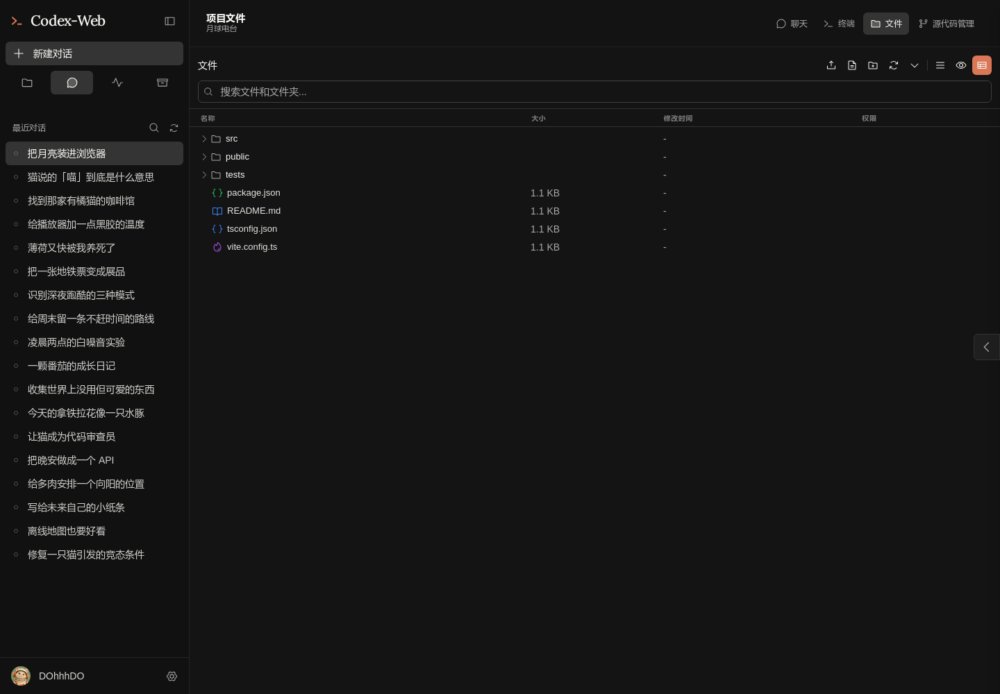
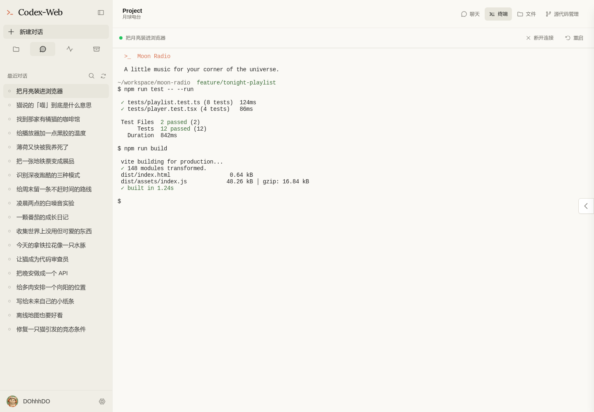
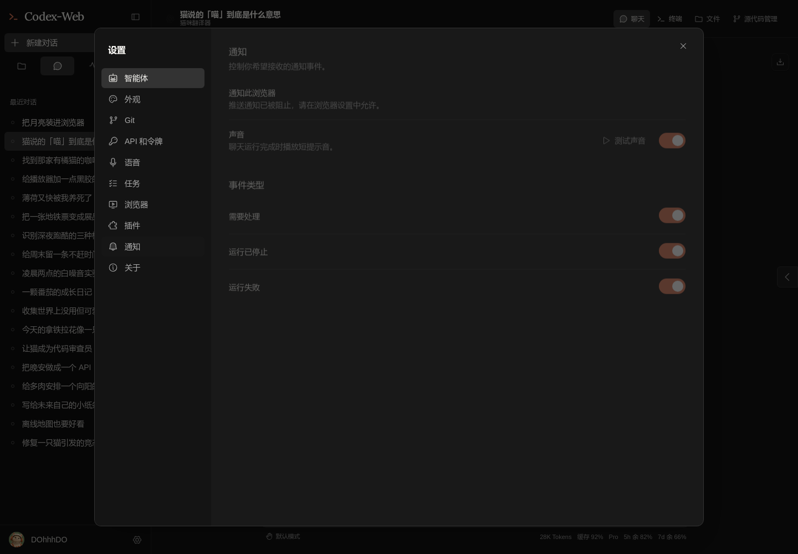
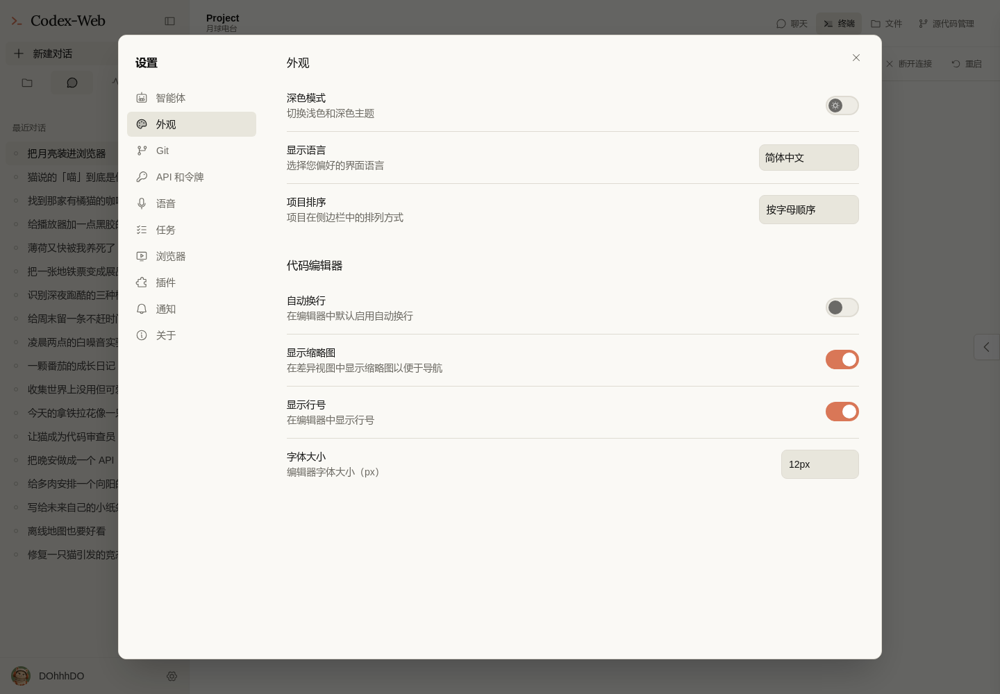
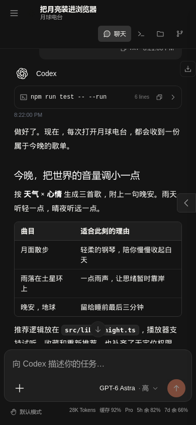
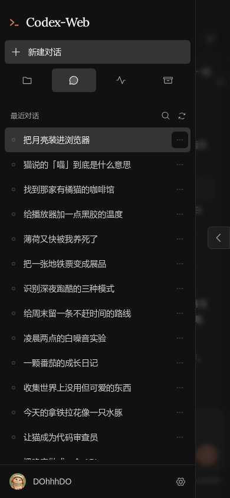

# 截图画廊 / Screenshot gallery

[中文介绍](../../README.md) · [English introduction](../../README.en.md)

所有截图使用 DOhhhDO 演示账号和虚构数据。桌面截图为 1440 × 1000，手机截图为 390 × 844。点击图片可查看原始尺寸。

All screenshots use the DOhhhDO demo account and fictional data. Desktop captures are 1440 × 1000; mobile captures are 390 × 844. Open an image to view it at full size.

## 对话 · 深色 / Chat · dark


## 对话 · 浅色 / Chat · light


## 猫咪翻译器 / Cat translator



## 工程首页 / Project home


## 项目侧栏 / Project sidebar



## 模型菜单 / Model menu



## 思考档位 / Reasoning effort


## 展开的工具输出 / Expanded tool output



## 文件 / Files



## 终端 · 深色 / Terminal · dark


## 终端 · 浅色 / Terminal · light



## 通知设置 / Notifications



## 外观设置 / Appearance



## 手机对话与侧栏 / Mobile chat and sidebar

 

## 自己截图 / Capture your own

```bash
npm ci
npm run build:client
npm run demo
```

Open `http://localhost:3002`. Use `/?theme=light`, `/?theme=dark`, or `/?home=1` to switch scenes. See [demo instructions](../../scripts/demo/README.md).
